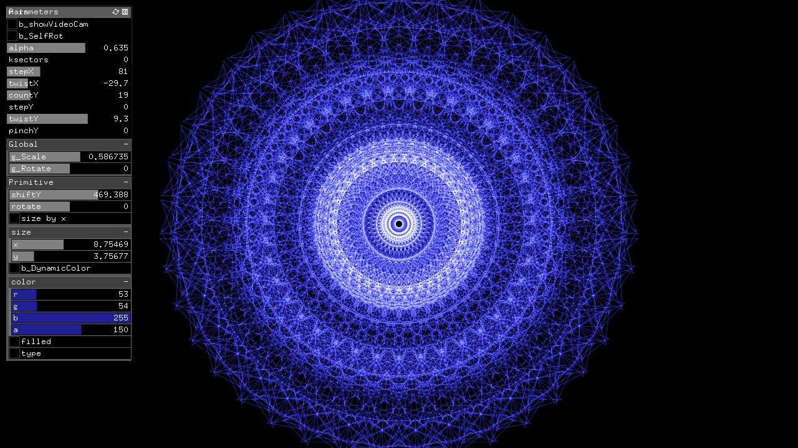

#study__synthesizer

##環境
*	OS X El Capitan(10.11.6)
*	Xcode : 7.2
*	oF : 0.9.0

##add on
ofxGui  
ofxNetwork  
ofxOsc  
ofxXmlSettings  

##Contents
study__musicUdpと連携して動作。  
fft連動して、幾何学模様を動かす。  

  

##Device

##note

